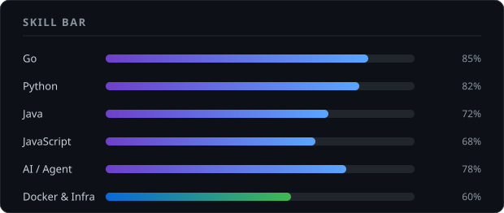

<picture>
  <source media="(prefers-color-scheme: dark)" srcset="assets/banner-dark.svg" />
  <source media="(prefers-color-scheme: light)" srcset="assets/banner-light.svg" />
  
</picture>

 

---

## 🧠 我在折腾什么

| 方向 | 项目 | 说明 |
|------|------|------|
| 🤖 **Agent 内核** | [DeepSeek-Harness-Core](https://github.com/LambdaJoker/DeepSeek-Harness-Core) | AI 人格核心进化插件，研究 Harness 层的可插拔设计 |
| 🔍 **RAG** | [rag-web-ui](https://github.com/LambdaJoker/rag-web-ui) | 检索增强生成驱动的智能对话系统 |
| 🧭 **Agent 应用** | [TripAgent](https://github.com/LambdaJoker/TripAgent) | 城市旅行轨迹规划，把行程交给 Agent 排 |
| 🍳 **Agent 应用** | [ChefAgent](https://github.com/LambdaJoker/ChefAgent) | 私人 AI 厨房：食谱、备餐、烹饪全流程指导 |
| ⚙️ **后端 & 微服务** | [WebSupervisor-microservice-v2](https://github.com/LambdaJoker/WebSupervisor-microservice-v2) | Go 写的微服务 |
| 🤖 **自动化** | [Lambdabot](https://github.com/LambdaJoker/Lambdabot) | Python 机器人，什么都想让它替我干点 |

> **一句话概括：** 让 Agent 真正跑起来，而不是只在 demo 里跑。

---

## 🛠 技术栈

**Languages**
 

**Backend & Infra**
 

**AI**
 

---

## 📌 精选项目

---

## 📊 我的 GitHub 数据

---

## 🐍 我的贡献贪吃蛇

---

## 🏆 成就徽章

---

<b>🌱 最近在学 & 想一起搞的事</b>（点开）

 

- 🧩 **Agent Harness 架构** — 怎么让「人格 / 工具 / 记忆」变成可插拔的模块
- 🔍 **RAG 检索链路** — 检索质量比模型参数更能决定体验上限
- ⚙️ **Go 微服务治理** — 从能跑，到跑得稳
- 🤝 **想找人一起** — 对 Agent 应用落地感兴趣的同学，欢迎开 issue 唠

## 📫 找到我

 

纯 Markdown + GitHub Actions 手搓 · 贪吃蛇每 12 小时自动刷新 🤖

